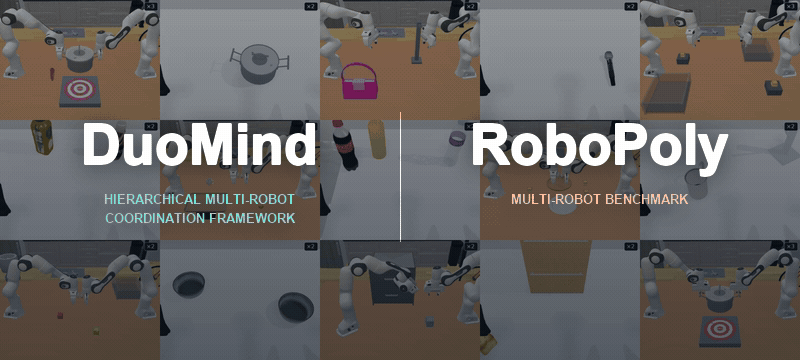
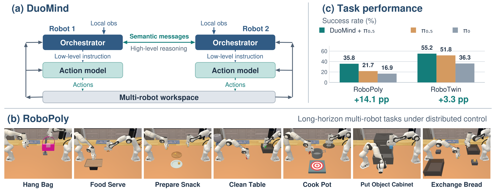
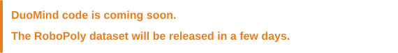

<h1 align="center">DuoMind: Enabling Multi-Robot Coordination via Communication</h1>

<p align="center">
  <a href="https://arxiv.org/pdf/2610.02161"></a>
  <a href="https://hanchuzhou.github.io/duomind_project_page/"></a>
  <a href="https://huggingface.co/datasets/ucd-dare/robopoly_demo/tree/main"></a>
</p>

<p align="center">
  <a href="https://hanchuzhou.github.io/duomind_project_page/" title="Watch the full DuoMind and RoboPoly overview video">
    
  </a>
</p>

<p align="center">
  
</p>

DuoMind is a distributed hierarchical framework for multi-robot coordination through semantic communication. We enable multi-robot collaboration to unlock their capability on complex tasks.

 We also introduce RoboPoly, a multi-robot benchmark comprising long-horizon manipulation tasks that require coordinated execution under distributed control.



## Installation

To install the environment and download 3D assets, run the commands from the repository root:

```bash
uv venv --python 3.11 .venv-robopoly
source .venv-robopoly/bin/activate
uv pip install -r script/requirements_robopoly.txt
uv pip install --no-deps -e .

export MS_ASSET_DIR="$PWD/.cache/robopoly"
python -m robopoly.utils.download_asset ReplicaCAD
python -m robopoly.utils.download_asset RoboCasa
```

## Dataset

RoboPoly contains seven multi-robot tasks: `hang_bag`, `food_serve`, `prepare_snack`, `clean_table`, `cook_pot`,
`put_object_cabinet`, and `exchange_bread`. We provide 50 expert demonstrations for each of the tasks in the
[expert demonstration dataset](https://huggingface.co/datasets/ucd-dare/multi-agent-demo).

To generate more data with our planning-based pipeline:

```bash
TASK=clean_table
DEMOS=50
python dataset_generation/generate_dataset_unified.py \
  --task "$TASK" --num-traj "$DEMOS" --start-seed 0 \
  --record-dir "data/robopoly/generated/$TASK" --out "${TASK}_dataset"
```

Change `TASK` and `DEMOS` to select the task and dataset size. Use a new output
directory for each run. The generator saves successful expert trajectories
(states and actions) and per-robot instruction metadata. Add `--save-video` for
preview videos; use the task-specific `rerender_dataset*.py` scripts in
[dataset_generation/](dataset_generation/) to add camera observations.

## Register your algorithm

We provide a registered [policy template](policy/custom/my_policy.py) that follows the distributed settings. Implement only `load_model(config)` to load your checkpoint;

The loaded model must implement `infer(observation)` and return
`{"actions": own_action}`.

Each policy receives the global
RGB image, **its own wrist RGB image**, its own 8-value state, and the **high-level
task instruction**. Images use `(3, H, W)` format. The other robot's wrist image
and state are not exposed. Each robot has a separate policy instance.

The returned actions have shape `(8,)` or `(T, 8)` for an action chunk:
seven absolute joint targets in radians and a normalized gripper command
(`-1` closed, `+1` open). The evaluator combines the two robots' actions.

## Evaluation

After registering policy in the template, evaluate your policy:

```bash
python script/benchmark.py eval robopoly clean_table \
  --mode custom --custom-policy policy.custom.my_policy:my_algorithm \
  --gpus 0 --episodes 20 --videos 2
```

Replace `clean_table` with any task above. Use `--policy-config config.json` for
model settings, and
`--experiment exp_name` to customize the run name.
Use `--episodes 400` to control rollout episodes, `--seed SEED` to change the starting seed, and `--videos 5` to generate certain numbers of visualization videos.

Metrics and videos are saved under
`eval_result/robopoly/<environment>/custom/<experiment>/`.


## Citation

If you use DuoMind, please cite:

```bibtex
@misc{zhou_duomind,
  title = {{DuoMind}: Enabling Distributed Multi-Robot Coordination with Semantic Communication},
  author = {Zhou, Hanchu and Gao, Dechen and Wang, Hang and Lynch, Brendan and Zhao, Boqi and Ma, Qiyao and Goyal, Raman and Zhang, Junshan},
  url = {https://arxiv.org/abs/2610.02161}
}
```

## Acknowledgments

The DuoMind codebase is developed based on RoboTwin 2.0, and RoboPoly is built on ManiSkill 3. We thank Keyu Zhu and Vivian Xie for their contributions to building
RoboPoly.
